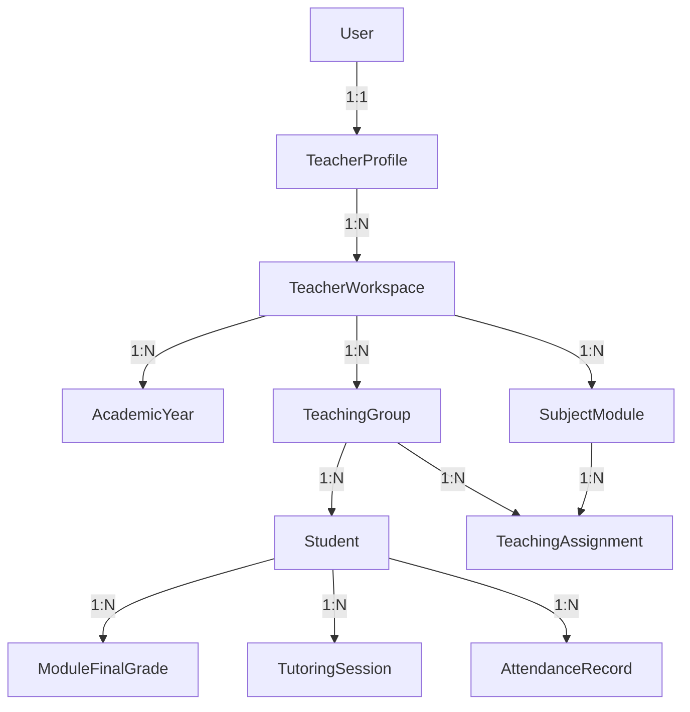

# Visión general de arquitectura

Teacher Brain es una plataforma fullstack construida con **Nx monorepo + Angular + NestJS + PostgreSQL + Prisma**.

## Principios

- **Modularidad por dominios**: identity, academic, curriculum, assessment, tutoring, analytics, reports.
- **Separación de capas**: presentación (Angular), aplicación (servicios NestJS), dominio (reglas puras), infraestructura (Prisma/Postgres).
- **Cloud-ready sin cloud-lock-in**: diseño multiusuario y multi-workspace desde el inicio.
- **Testing desde el inicio**: 789 tests (433 backend + 356 frontend).
- **Propiedad de datos por workspace**: cada query filtra por `workspaceId` del profesor autenticado.

## Aplicaciones del monorepo

| App | Propósito | Puerto dev |
|-----|-----------|------------|
| `teacher-brain-public` | Sitio público de captación, SEO/GEO, demo y landings | 4201 |
| `teacher-brain-web` | Aplicación autenticada para trabajo docente diario | 4200 |
| `teacher-brain-api` | Backend NestJS con API REST | 3000 |

## Dominios principales

### Identity
Autenticación JWT con cookies httpOnly, registro, login, recuperación de contraseña, perfil docente, onboarding guiado.

### Academic
Grupos (DAM, DAW, SMR), módulos profesionales, alumnado, asignaciones docente-grupo-módulo, curso académico, centro educativo.

### Curriculum
Resultados de Aprendizaje (RA), Criterios de Evaluación (CE), períodos de evaluación (1ª, 2ª, ordinaria, extraordinaria).

### Assessment
Actividades evaluables, rúbricas con criterios y niveles, correcciones por alumno, evidencias, notas trazables, notas finales de módulo.

### Tutoring
Sesiones de tutoría con niveles de sensibilidad (normal, privada, sensible, restringida), acuerdos, seguimiento, revisión periódica.

### Analytics
Dashboards de riesgo académico, analítica comparativa entre evaluaciones, evolución por alumno, resúmenes de grupo.

### Reports
Informes docentes, actas de evaluación, comunicaciones a familias, programación didáctica exportable.

### FFE / FCT
Gestión de prácticas en empresa: placements, visitas del tutor, evaluación final, timeline histórico.

## Cadena de propiedad de datos

Toda entidad docente está atada a un `TeacherWorkspace`. El backend filtra siempre por workspace del usuario autenticado.

## Enlaces

- [Roadmap de MVPs](/architecture/roadmap)
- [Índice de ADRs](/architecture/adrs)
- [Stack tecnológico](/architecture/stack)
- [Seguridad](/architecture/security)
